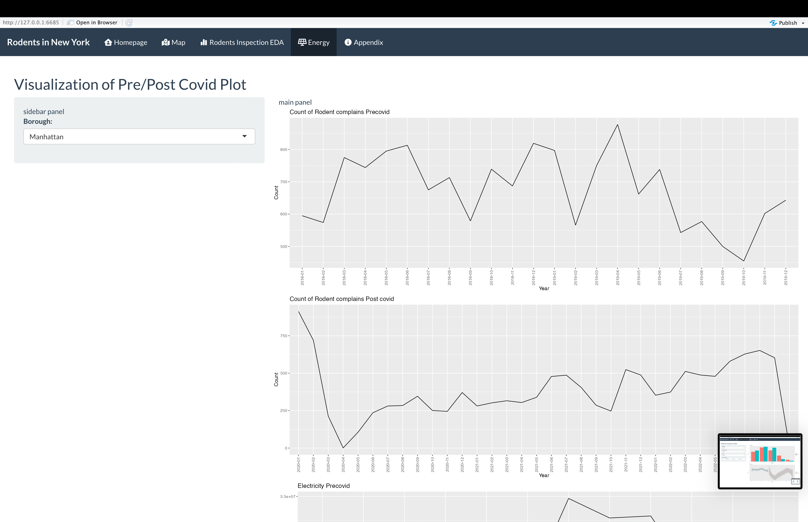
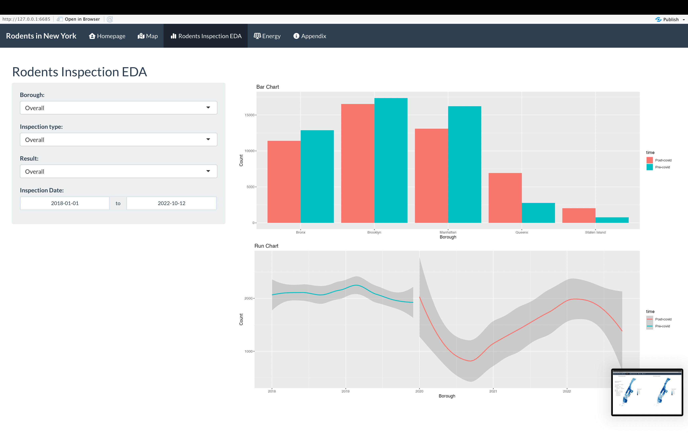
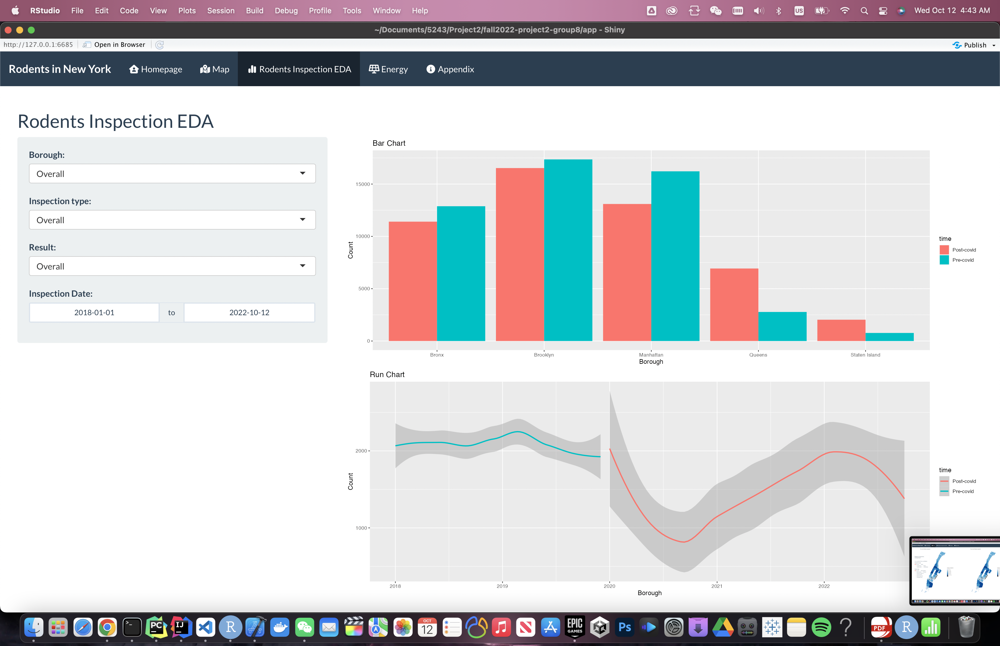
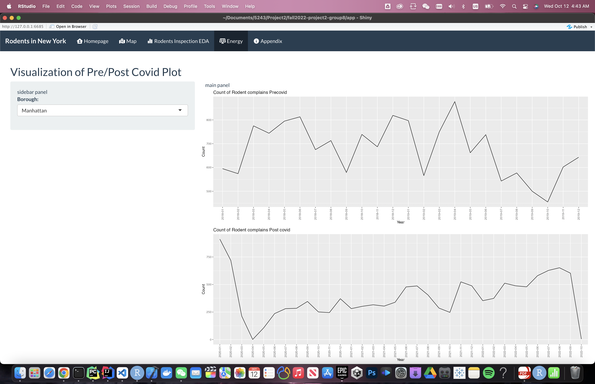

# Project 2: Shiny App Development

### [Project Description](doc/project2_desc.md)






In this second project of GR5243 Applied Data Science, we develop a *Exploratory Data Analysis and Visualization* shiny app on the work of a **NYC Rodents inspections** using NYC open data released on the [NYC Open Data By Agency](https://opendata.cityofnewyork.us/data/) website. See [Project 2 Description](doc/project2_desc.md) for more details.  

The **learning goals** for this project is:

- business intelligence for data science
- data cleaning
- data visualization
- systems development/design life cycle
- shiny app/shiny server

*The above general statement about project 2 can be removed once you are finished with your project. It is optional.

## Project Title Lorem ipsum dolor sit amet
Term: Fall 2022

+ Team 8
+ **Projec title**: + Team members
	+ Kim, Woonsup wk2371@columbia.edu
	+ Limaye, Dhruv djl2187@columbia.edu
	+ Sinha, Shreya ss6415@columbia.edu
	+ Tu, Zhongcheng zt2286@columbia.edu
	+ Xie, Peng px2143@columbia.edu

+ **Project summary**: In a densely populated city like New York, the presence of large numbers of rodents is a common problem. Rodent infestations can cause many problems including health hazards, spread of disease, and property damage. With the changes and fluctuations in the housing and rent markets caused by the COVID-19 pandemic, it is especially important for New York city residents to understand how their properties and residences could be affected by the presence of rodents. It is also important for consumers to understand how accurate the rodent data is by understanding how recently the inspections for rodents were conducted. 

Therefore, as an extermination and property maintenance company, we sought to provide our consumers with data to understand rodent infestations in their neighborhoods and how it can affect their energy costs. We provided an interactive map of NYC to show the areas and neighborhoods where rodent infestations are most prevalent. Similarly, we displayed an interactive map that showed the prevalence of rodent inspections in each area. We also showed barplots of this data, and barplots and heat maps showing the correlation between rodent infestations and energy costs in the boroughs of New York City.


+ **Contribution statement**: ([default](doc/a_note_on_contributions.md)) All team members contributed equally in all stages of this project. All team members approve our work presented in this GitHub repository including this contributions statement. 

Shreya conributes to looking for the required datasets.

Woonsup contributes to prepocessing Rodent Inspections Dataset. 

Shreya contributes to graphs of rodents inspections and energy trend line.

Peng contributes to the ui design and the geographical zip code map.

Peng and shreya help debug the code.

Peng deployde shiny app.

Dhruv contributes to the summary and conclusion of the project.

Zhongcheng is the presenter of the project.

See [App](https://kazesword.shinyapps.io/fall5243-project2/)

Following [suggestions](http://nicercode.github.io/blog/2013-04-05-projects/) by [RICH FITZJOHN](http://nicercode.github.io/about/#Team) (@richfitz). This folder is orgarnized as follows.

```
proj/
├── app/
├── lib/
├── data/
├── doc/
└── output/
```

Please see each subfolder for a README file.

