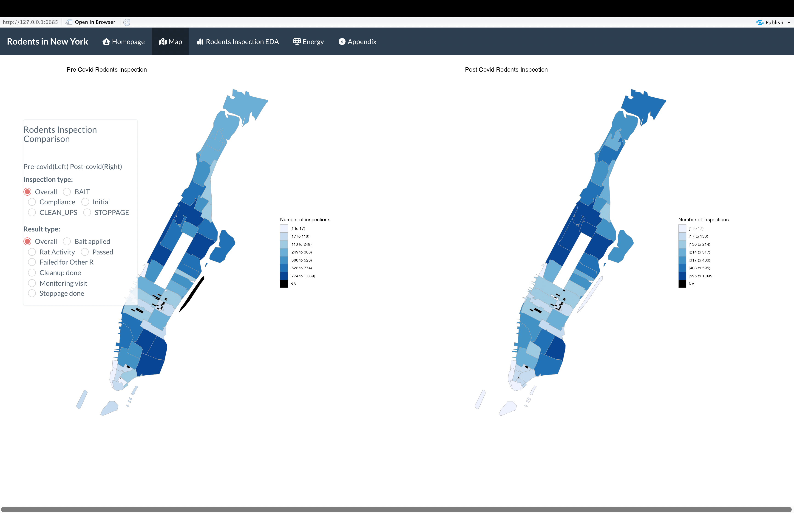

# Project 2: Shiny App Development

### [Project Description](doc/project2_desc.md)





In this second project of GR5243 Applied Data Science, we develop a *Exploratory Data Analysis and Visualization* shiny app on the work of a **NYC Rodents inspections** using NYC open data released on the [NYC Open Data By Agency](https://opendata.cityofnewyork.us/data/) website. See [Project 2 Description](doc/project2_desc.md) for more details.  

Overview:
Our team presents a vision for a property maintenance and extermination services company that helps residents of New York City understand the impacts of rodent infestations on energy consumption and the prevalence of rodent infestations in different regions in New York City. Rodent infestations can have many negative impacts on communities and can carry diseases, affect the safety of residents, and affect various essential utilities and processes in buildings including wiring, piping, sanitation systems, and heating systems. Thus, it is essential for residents of New York City to be aware of the levels of rodent infestations in their specific neighborhoods, the frequency of inspections conducted, and how the infestations can affect their energy costs.

​​We believe that these companies should rely on data driven models for their recommendations. Using open data from New York City, we present dashboards that creatively display rodent data and correlations to energy costs to make it easier to understand for NYC residents.


The four tabs presented are a proof of concept, illustrating:

Map:
The maps show a heatmap indicating the number of rodents found and number of inspections conducted in each zipcode in NYC before and after the COVID 19 pandemic.

Inspection Data:
This tab shows a collection of bar plots and trend plots that display the number of inspections and rodent complaint data over time and before and after COVID.

Energy:
This tab shows a heat map and barplots of how the counts of rodent infestations correlate with the energy costs in those specific neighborhoods in New York City. 

Note for Missing Data:
For the energy analysis, we had some missing data for the year 2018 for energy costs, so the heat map and barplots display the data from years 2019-2021. However, these years do provide insight into how the data differs before and after the COVID-19 Pandemic.


## Project Title: Understanding Impacts of Rodent Infestations in New York City
Term: Fall 2022

+ Team 8
+ **Projec title**: + Team members
	+ Kim, Woonsup wk2371@columbia.edu
	+ Limaye, Dhruv djl2187@columbia.edu
	+ Sinha, Shreya ss6415@columbia.edu
	+ Tu, Zhongcheng zt2286@columbia.edu
	+ Xie, Peng px2143@columbia.edu

+ **Project summary**: 
In a densely populated city like New York, the presence of large numbers of rodents is a common problem. Rodent infestations can cause many problems including health hazards, spread of disease, and property damage. With the changes and fluctuations in the housing and rent markets caused by the COVID-19 pandemic, it is especially important for New York city residents to understand how their properties and residences could be affected by the presence of rodents. It is also important for consumers to understand how accurate the rodent data is by understanding how recently the inspections for rodents were conducted. 
Therefore, as an extermination and property maintenance company, we sought to provide our consumers with data to understand rodent infestations in their neighborhoods and how it can affect their energy costs. We provided an interactive map of NYC to show the areas and neighborhoods where rodent infestations are most prevalent. Similarly, we displayed an interactive map that showed the prevalence of rodent inspections in each area. We also showed barplots of this data, and barplots and heat maps showing the correlation between rodent infestations and energy costs in the boroughs of New York City.

The four tabs presented are a proof of concept, illustrating:

Map:
The maps show a heatmap indicating the number of rodents found and number of inspections conducted in each zipcode in NYC before and after the COVID 19 pandemic.

Inspection Data:
This tab shows a collection of bar plots and trend plots that display the number of inspections and rodent complaint data over time and before and after COVID.

Energy:
This tab shows a heat map and barplots of how the counts of rodent infestations correlate with the energy costs in those specific neighborhoods in New York City.

Missing Data Note:
In the energy dataset. we had some missing data for the year 2018 for energy costs, due to clerical steps in data collection. Thus, the heat map and barplots display the data from years 2019-2021, and the conclusions are derived from these three years..

+ **How to use the Application**:
 
1. Clone the github repository in your local computer. Run server.py . The app should get deployed for your machine. 
2. Other alternative:Deploying it using the link provided for the app. 

+ **Contribution statement**: ([default](doc/a_note_on_contributions.md)) All team members contributed equally in all stages of this project. All team members approve our work presented in this GitHub repository including this contributions statement. 

Shreya conributes to looking for the required datasets.

Woonsup contributes to prepocessing Rodent Inspections Dataset. 

Shreya contributes to graphs of rodents inspections and energy trend line and correlation matrix.

Peng contributes to the ui design and the geographical zip code map.

Peng and shreya help debug the code.

Peng deployde shiny app.

Dhruv contributes to the summary and conclusion of the project.

Zhongcheng is the presenter of the project.

See [App](https://kazesword.shinyapps.io/fall5243-project2/)

Following [suggestions](http://nicercode.github.io/blog/2013-04-05-projects/) by [RICH FITZJOHN](http://nicercode.github.io/about/#Team) (@richfitz). This folder is orgarnized as follows.

```
proj/
├── app/
├── lib/
├── data/
├── doc/
└── output/
```

Please see each subfolder for a README file.

